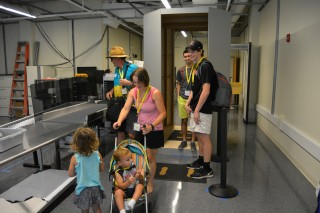
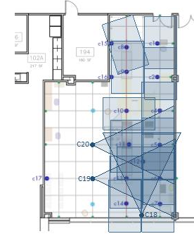
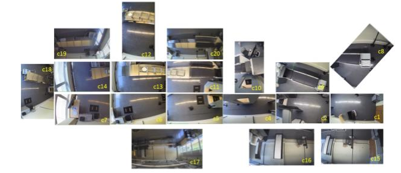
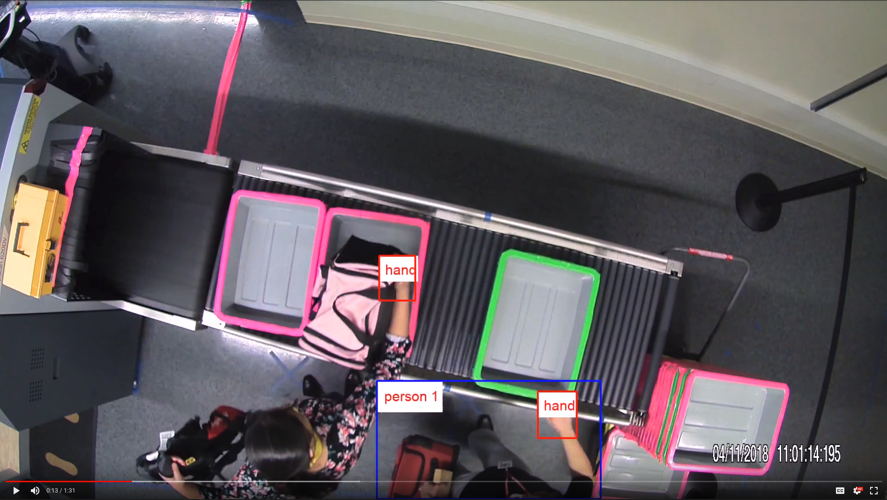
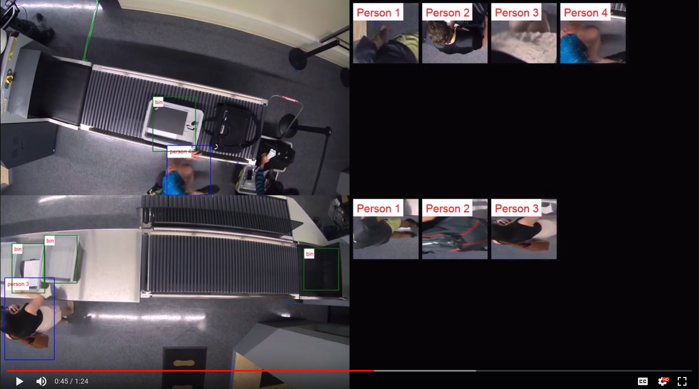

# CLASP (Correlating Luggage and Specific Passengers)

## Background
Supported by [DHS](https://www.dhs.gov/science-and-technology), the purpose of this work is to develop a computer vision system to automatically track passengers and their luggages when they are passing through
checkpoints, to maintain the association of each item to its owner, and to detect security incidents such as theft. Motivated by this, video data is collected by [ALERT](http://www.northeastern.edu/alert/) center at Boston from a multi-camera network, which is distributed at a simulated airport security screening checkpoint. The videos record multiple exercises of passengers passing through the mock checkpoint with real baggages. Their behaviors were designed to simulate real-world scenarios. See [here](http://www.northeastern.edu/alert/news-article/alert-launches-video-analytics-lab-at-kostas-research-institute/) for more details of the background of this project. The output of this project has been presented on [ADSA'18](http://www.northeastern.edu/alert/transitioning-technology/adsa/) by [Hanxiao Wang](https://scholar.google.com/citations?user=mWfsm1EAAAAJ&hl=en) and highly regarded by program committees and industry parteners.

    
  <em>Video data collection at ALERT center with a real checkpoint setup.</em>

## Overview
Videos are collected from a multi-camera network at a simulated checkpoint, consist of 20 different cameras intalled on the ceiling. A group of human actors were required to pass through the checkpoint with their luggages with behaviors just as in the real world. Multiple scenarios are considered, such as normal devestiture and collection, theft, breaking in lines, moving bins and items, secondary inspections, etc.

     
  <em>Camera network layout at the security checkpoint.</em>

The system implemented here contains 5 functional modules:

* Person/Bin/Hand Detection: training and deploying a Faster-RCNN model (ResNet-101) to detect persons, bins and hands
* Person/Bin Tracking:
   - single camera tracking: appearance model: deep features; Speed and Location model: Kalman filter
   - multi camera tracking: multi-shot person re-identification with deep features
* Person-Item Association: associate a person to the items he/she interacts with
* Ownership Verification: verity the identity of the person for a specific item at both the collection and divesiture point.
* Event Detection and Log Generation: record the time of each event and generate log files.

## Demo

* single camera video sequences

* multi camera videos sequences

## Usage

- Preliminary: `tensorflow 1.4`, `numpy`, `cv2 (opencv)`
- Download pre-trained models at [here](https://drive.google.com/drive/folders/10a4OjGeumilISq97FOiNr6hRdmlPSFgt) indo `models/`
- Put your videos in `result/original/`, e.g. cam1.mp4, cam2.mp4, ...
- Pass the video names in `run_pipeline.sh` and run it
